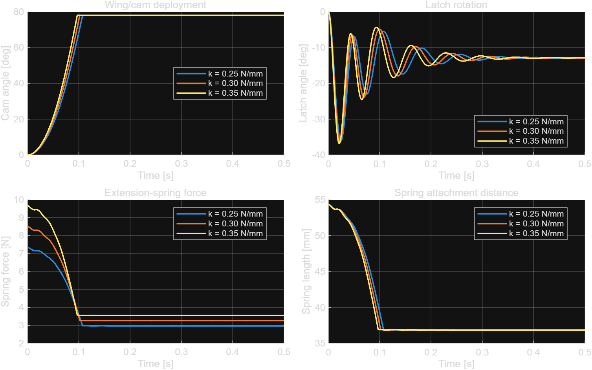
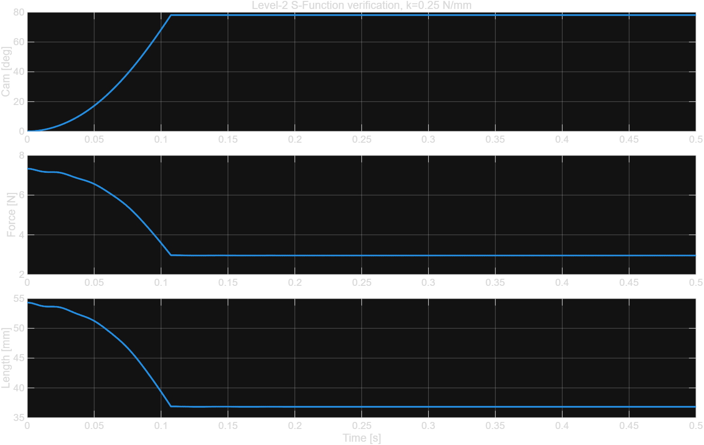

<<<<<<< HEAD
# Net Module Spring Release Mechanism

드론 날개를 잠금 상태에서 스프링 힘으로 전개하고, 연동 래치를 해제하는 `net_module` 메커니즘의 Fusion 360 설계 파일과 MATLAB/Simulink 동역학 검증 자료를 정리한 프로젝트다.

## 결론

현재 형상과 추정 질량을 기준으로 한 1차 권장 사양은 다음과 같다.

| 항목 | 권장값 |
|---|---:|
| 스프링 종류 | 인장 스프링 |
| 스프링 상수 | **0.25 N/mm 전후** |
| 자유 길이(후크 포함) | **약 31 mm** |
| 초기 장력 | **약 1.5 N** |
| 잠금 상태 장착점 거리 | 54.339 mm |
| 전개 상태 장착점 거리 | 약 35.6~36.83 mm |
| 요구 안전 신장량 | 최소 24 mm 이상 |
| 잠금 상태 장력 | 약 7.33 N |
| 예상 90% 전개 시간 | 약 101.5 ms |
| 예상 최대 캠 각속도 | 약 1,346 deg/s |
| 권장 외경/선경 시작 범위 | 외경 6~8 mm / 선경 0.6~0.8 mm |

구매 또는 제작 시에는 `k ≈ 0.25 N/mm`, 자유 길이 약 31 mm, 최대 사용 길이 54.34 mm에서 반복 사용 가능한 제품을 우선 검토한다. 후크가 진동으로 빠지지 않도록 폐쇄형 루프 또는 별도 이탈 방지 구조를 사용하는 것이 좋다.

## 시뮬레이션 결과

### 스프링 상수 비교

| 스프링 상수 | 90% 전개 시간 | 최대 캠 각속도 | 잠금 장력 |
|---:|---:|---:|---:|
| **0.25 N/mm** | **101.45 ms** | **1,345.6 deg/s** | **7.33 N** |
| 0.30 N/mm | 96.22 ms | 1,421.6 deg/s | 8.50 N |
| 0.35 N/mm | 91.75 ms | 1,494.1 deg/s | 9.67 N |

0.35 N/mm는 0.25 N/mm보다 약 9.7 ms 빠르지만 잠금 장력이 약 32% 증가한다. 3D 프린트 래치의 충격, 마모, 체결 하중을 고려하면 0.25 N/mm가 가장 균형 잡힌 시작점이다.



### MATLAB과 Simulink 교차 검증

| 항목 | MATLAB | Simulink | 차이 |
|---|---:|---:|---:|
| 90% 전개 시간 | 101.45 ms | 101.53 ms | 0.08 ms |
| 최대 캠 각속도 | 1,345.6 deg/s | 1,346.0 deg/s | 0.4 deg/s |
| 최대 스프링 장력 | 7.33 N | 7.33 N | 사실상 일치 |

Simulink 최종 상태는 캠 각도 78.10 deg, 래치 각도 -12.88 deg, 최소 스프링 길이 36.83 mm로 계산됐다.



## Fusion 360 측정값

- 잠금 상태 스프링 장착점 중심 거리: 54.339 mm
- 전개 상태 거리: 약 35.6 mm(화면 형상 추정), Simulink 최소 거리 36.83 mm
- 큰 캠 장착점 모멘트암: 약 14.7 mm
- 래치 장착점 모멘트암: 약 6.3 mm
- PLA 100% 솔리드 가정 출력 부품 질량: 약 42.6 g
- RS2205 2300KV 모터 질량: 제조사 정보가 없어 30 g으로 가정

PLA 질량은 Fusion 솔리드 체적에 밀도 1.24 g/cm³를 적용한 값이다. 실제 인필, 벽 수, 볼트와 배선이 반영되지 않았으므로 출력 후 실측 질량과 무게중심으로 갱신해야 한다.

## 모델 구성

검증된 Simulink 모델은 2자유도 평면 모델이며 다음 효과를 포함한다.

- 캠/날개 회전 관성
- 래치 회전 관성
- 중력 토크
- 회전 감쇠(마찰 근사)
- 장착점 형상에 따른 인장 스프링 힘과 토크
- 캠 및 래치 회전 제한

`simulation/simulink/drone_spring_2dof_sfun.slx`가 검증된 모델이다. 동역학은 `drone_spring_sfun.m`에 구현돼 있다.

## 실행 방법

필요 환경:

- MATLAB R2025b 또는 호환 버전
- Simulink

MATLAB 파라미터 스윕:

```matlab
run('simulation/matlab/drone_spring_preliminary_sim.m')
```

Simulink 모델 재생성 및 검증:

```matlab
run('simulation/simulink/build_drone_spring_simulink_sfun.m')
```

저장된 Simulink 모델을 직접 열려면:

```matlab
open_system('simulation/simulink/drone_spring_2dof_sfun.slx')
```

모델의 `Spring rate N_per_mm` 블록 값을 변경하면 다른 스프링 상수를 시험할 수 있다.

## 프로젝트 구조

```text
cad/fusion360/                 Fusion 360 부품 모델(.f3d)
simulation/matlab/             MATLAB 파라미터 스윕 및 결과
simulation/simulink/           검증된 Simulink/S-Function 모델 및 결과
docs/figures/                  결과 그래프
```

## 한계와 다음 검증

현재 결과는 스프링 1차 선정용이다. 최종 선정 전 다음 값을 실측해 모델을 갱신해야 한다.

1. 출력 완료된 날개/캠/래치의 실제 질량과 무게중심
2. 래치가 풀릴 때 필요한 실제 힘 또는 토크
3. 회전축 마찰과 조립 공차
4. 스프링 제조사의 초기 장력 및 허용 최대 신장량
5. 최소 100회 반복 전개 시험 후 PLA 마모와 균열 여부

특히 프로펠러가 회전 중인 상태의 전개는 현재 모델 범위 밖이다. 비행 중 전개를 계획한다면 공력 하중, 모터 자이로 효과, 충격 하중을 별도로 검토해야 한다.
=======
# net-module-spring-release
>>>>>>> 4ec0f1f86857df83d7678cfb59a179a8000f56a4
